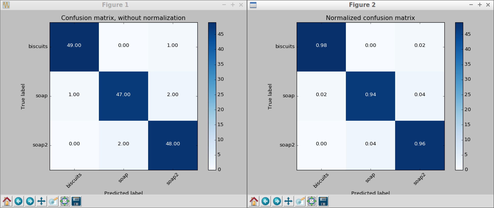
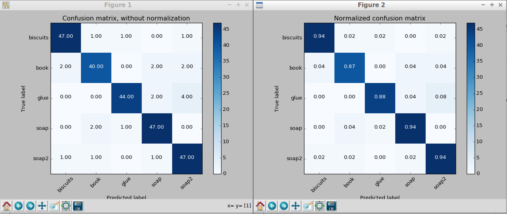
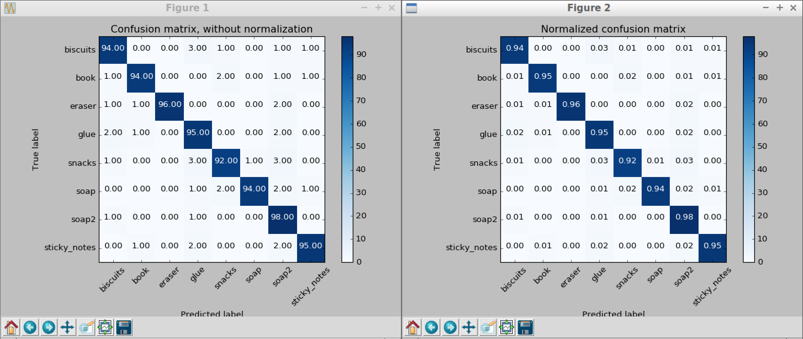
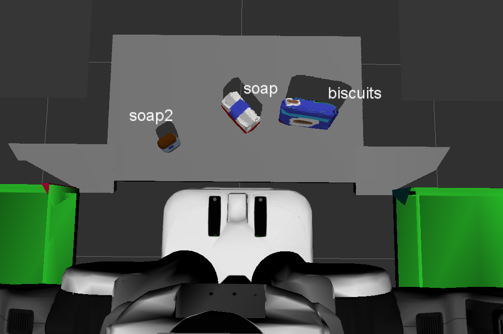
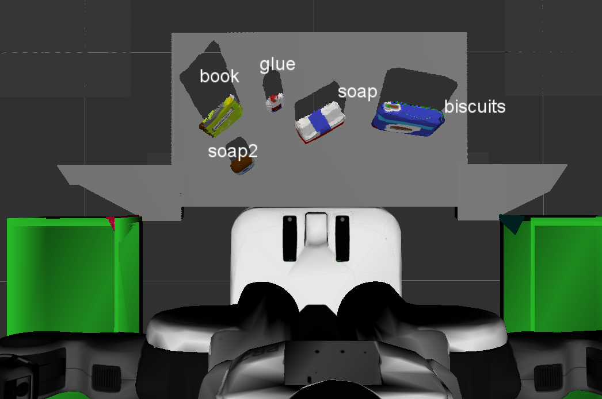
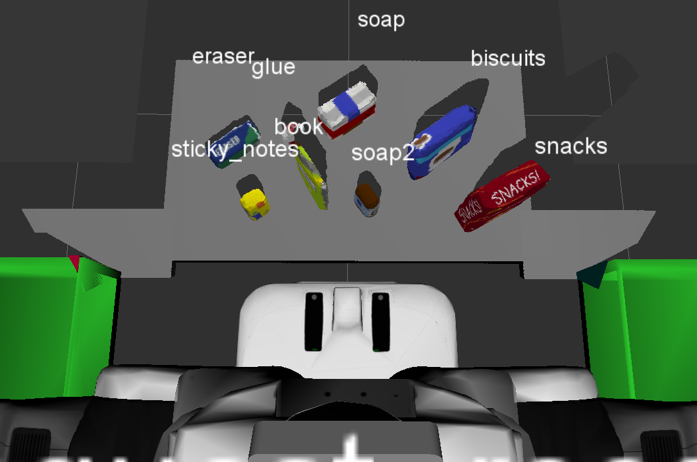

# Perception Project Writeup

Before I implemented the exercises in the perception pipeline, 
I had to first apply statistical filter to remove noise from the data like so,
``` 
    # Much like the previous filters, we start by creating a filter object:

    # Test on original image
    outlier_filter = cloud.make_statistical_outlier_filter()

    # Set the number of neighboring points to analyze for any given point
    outlier_filter.set_mean_k(5)

    # Set threshold scale factor
    x = 0.15

    # Any point with a mean distance larger than global (mean distance+x*std_dev) will be considered outlier
    outlier_filter.set_std_dev_mul_thresh(x)

    # Finally call the filter function for magic
    cloud = outlier_filter.filter()
```
### Exercise 1, 2 and 3 pipeline implemented
#### 1. Exercise 1 steps. Pipeline for filtering and RANSAC plane fitting implemented.

In Exercise 1, various filters were applied to simulated point cloud data, 
and finally perform RANSAC segmentation to isolate objects in the scene.

* ##### Voxel Grid Downsampling 
    A voxel grid filter allows you to downsample the data by taking a spatial average of the points 
    in the cloud confined by each voxel. You can adjust the sampling size by setting the voxel size 
    along each dimension. The set of points which lie within the bounds of a voxel are assigned to 
    that voxel and statistically combined into one output point.
    
    * To run this project in my machine decently, I applied a voxel grid filter to reduce the number
      of point clouds and still do a good job of representing the input point cloud as a whole.

    ``` 
        # Create a VoxelGrid filter object for our input point cloud
        vox = cloud.make_voxel_grid_filter()
    
        # Choose a voxel (also known as leaf) size
        LEAF_SIZE = 0.01
    
        # Set the voxel (or leaf) size
        vox.set_leaf_size(LEAF_SIZE, LEAF_SIZE, LEAF_SIZE)
    
        # Call the filter function to obtain the resultant downsampled point cloud
        cloud_filtered = vox.filter()
    ``` 

* ##### Pass Through Filter
    The pass through filter removes useless data from the point cloud, works much like a cropping tool, 
    which allows you to crop any given 3D point cloud by specifying an axis with cut-off values along that axis. 
    The region you allow to pass through, is often referred to as region of interest. 

    * I created two filters to rid of the background and the bins beside the robot so the focus is aimed towards the table with the objects.
    
    ``` 
        # Create a PassThrough filter object.
        passthrough = cloud_filtered.make_passthrough_filter()
    
        # Assign axis and range to the passthrough filter object.
        filter_axis = 'z'
        passthrough.set_filter_field_name(filter_axis)
    
        axis_min, axis_max = 0.6, 0.75
        passthrough.set_filter_limits(axis_min, axis_max)
    
        # Finally use the filter function to obtain the resultant point cloud.
        cloud_filtered = passthrough.filter()
    
        passthrough = cloud_filtered.make_passthrough_filter()
    
        # Add another passthrough filter to get rid of the bins
        filter_axis = 'y'
        passthrough.set_filter_field_name(filter_axis)
    
        axis_min, axis_max = -0.4, 0.4
        passthrough.set_filter_limits(axis_min, axis_max)
    
        # Finally use the filter function to obtain the resultant point cloud.
        cloud_filtered = passthrough.filter()
    ``` 

* ##### RANSAC Plane Segmentation
    RANSAC is an algorithm, that you can use to identify points in your dataset that belong to a particular model. 
    In the case of the 3D scene we're working with here, the model we choose could be a plane, a cylinder, a box, 
    or any other common shape.

    * Here we apply the RANSAC segmentation then we extract out the inliers (table) and outliers (objects) 
    to isolate the table from the objects

    ``` 
        # Create the segmentation object
        seg = cloud_filtered.make_segmenter()
    
        # Set the model you wish to fit
        seg.set_model_type(pcl.SACMODEL_PLANE)
        seg.set_method_type(pcl.SAC_RANSAC)
    
        # Max distance for a point to be considered fitting the model
        max_distance = 0.01
        seg.set_distance_threshold(max_distance)
    
        # Call the segment function to obtain set of inlier indices and model coefficients
        inliers, coefficients = seg.segment()
    
        # Extract inliers
        cloud_table = cloud_filtered.extract(inliers, negative=False)
    
        # Extract outliers
        cloud_objects = cloud_filtered.extract(inliers, negative=True)
    ``` 

#### 2. Exercise 2 steps: Pipeline including clustering for segmentation implemented.
Ultimately in this exercise, the goal is to write a ROS node that takes in the camera data as a point cloud, 
filters that point cloud, then segments the individual objects using Euclidean clustering.
* ##### Euclidean Clustering
    Now that you have filtered out the table plane, and all points outside of the region of interest, 
    we can now apply Euclidean clustering.
    * ###### Construct a k-d tree
        The k-d tree data structure is used in the Euclidean Clustering algorithm to decrease the 
        computational burden of searching for neighboring points.
        * To construct a k-d tree, first we convert the XYZRGB point cloud to XYZ, because PCL's 
          Euclidean Clustering algorithm requires a point cloud with only spatial information then 
          we construct a k-d tree from it. 
          ``` 
              white_cloud = XYZRGB_to_XYZ(cloud_objects)
              tree = white_cloud.make_kdtree()
          ``` 
    * ###### Cluster Objects
        Once we have our tree, we can perform cluster extraction like so,
        ```
            # Create a cluster extraction object
            ec = white_cloud.make_EuclideanClusterExtraction()
        
            # Set tolerances for distance threshold
            # as well as minimum and maximum cluster size (in points)
            # NOTE: These are poor choices of clustering parameters
            # Your task is to experiment and find values that work for segmenting objects.
        
            ec.set_ClusterTolerance(0.02)
            ec.set_MinClusterSize(50)
            ec.set_MaxClusterSize(25000)
        
            # Search the k-d tree for clusters
            ec.set_SearchMethod(tree)
        
            # Extract indices for each of the discovered clusters
            cluster_indices = ec.Extract()
        ```
    
    * ###### Cluster Visualization
        In order to visualize the results in RViz, you need to create one final point cloud, 
        lets call it "cluster_cloud" of type PointCloud_PointXYZRGB. This cloud will contain 
        points for each of the segmented objects, with each set of points having a unique color.
        ```
            # Assign a color corresponding to each segmented object in scene
            cluster_color = get_color_list(len(cluster_indices))
        
            color_cluster_point_list = []
        
            for j, indices in enumerate(cluster_indices):
                for i, indice in enumerate(indices):
                    color_cluster_point_list.append([white_cloud[indice][0],
                                                     white_cloud[indice][1],
                                                     white_cloud[indice][2],
                                                     rgb_to_float(cluster_color[j])])
        
            # Create new cloud containing all clusters, each with unique color
            cluster_cloud = pcl.PointCloud_PointXYZRGB()
            cluster_cloud.from_list(color_cluster_point_list)
        ```        
    
* ##### Publish the Point Cloud
    After performing Euclidean extraction and the visualization method, we need to publish the 
    detected objects' point cloud and markers to show on RViz
    * ###### Initialize the ROS node. 
        In this step we are initializing a new node called "perception" in main.
        ``` 
            rospy.init_node('perception', anonymous=True)
        ``` 
        
    * ###### Create Subscribers. 
        We then subscribe our node to the "/pr2/world/points" topic. 
        Anytime a message arrives, the message data will be passed 
        to the pcl_callback() function for processing.
        ```
            pcl_sub = rospy.Subscriber('/pr2/world/points', pc2.PointCloud2, pcl_callback, queue_size=1)
         ```
         
    * ###### Create Publishers. 
        Here we're creating two new publishers, aside from the ones created previously, to publish the point cloud data 
        for the detected objects and the markers for each object to topics called detected_objects_pub and 
        object_markers_pub, respectively.
         ```
             object_markers_pub      = rospy.Publisher('/object_markers', Marker, queue_size=1)
             detected_objects_pub    = rospy.Publisher('/detected_objects', DetectedObjectsArray, queue_size=1)
        
             pcl_objects_pub         = rospy.Publisher('/pcl_objects', PointCloud2, queue_size=1)
             pcl_table_pub           = rospy.Publisher('/pcl_table', PointCloud2, queue_size=1)
             pcl_cluster_cloud_pub   = rospy.Publisher('/pcl_cluster', PointCloud2, queue_size=1)
         ```    ```
         
    * ###### Spin while node is not shutdown. 
        We prevent the node from exiting until an intentional shutdown is invoked.
         ```
             while not rospy.is_shutdown():
                rospy.spin()
         ```
     
    * ###### Publish ROS messages from your pcl_callback(). 
        * In pcl_callback() we want to first convert the PCL data into ROS messages
         ```
            ros_cloud_objects = pcl_to_ros(cloud_objects)
            ros_cloud_table = pcl_to_ros(cloud_table)
            ros_cluster_cloud = pcl_to_ros(cluster_cloud)
         ```
         * Then we can publish our cloud data into ROS
         ```
            pcl_objects_pub.publish(ros_cloud_objects)
            pcl_table_pub.publish(ros_cloud_table)
            pcl_cluster_cloud_pub.publish(ros_cluster_cloud)
         ```

#### 3. Exercise 3 Steps.  Features extracted and SVM trained.  Object recognition implemented.
   * ##### Features extraction
        * To start generating features, I launched the training.launch file from sensor_stick but modified 
          capture_features.py to generate features for each world accordingly as well as change the number of iterations 
          for each object to 50 for worlds 1 and 2 then to 100 for world 3 to improve the model
        
        * After generating the features for the objects, I ran the train_svm.py in sensor_stick and the results for
          all 3 models are as follows:
            * Model 1
            * Model 2
            * Model 3
   
### Pick and Place Setup

naked_pair#### 1. For all three tabletop setups (`test*.world`),  object recognition is performed, then read in respective pick list (`pick_list_*.yaml`). 
After completing all the exercises above, object recognition was performed for all 3 worlds, 
achieving 100% detection for all 3 worlds. Below are images are shown of each world's setup:

* test_1.world


* test_2.world


* test_3.world


Test World | Number of objects in Pick List | Number of objects detected | Accuracy
:---:      | :---:                          | :---:                      | :---:
1          | 3                              | 3                          | 100%
2          | 5                              | 5                          | 100%
3          | 8                              | 8                          | 100%

#### 2. Construct output files
After Pick and Place is performed, messages are constructed that would comprise a valid `PickPlace` 
request output them to `.yaml` format: output_1.yaml, output_2.yaml, output_3.yaml located in the scripts folder
under the outputs folder.

### Conclusion
For the most part the code didn't give much problems. I did have to change some values to have a better detection rate
in world 3 since it wasn't detecting the glue object due to its small cluster so the I changed the value of 
ec.set_MinClusterSize(50) in the Euclidean Extraction portion. 

I got rid of the bins beside the robot since it was interfering with the object recognition, 
I did this by adding another pass through filter in the y-axis and applying the appropriate values.

To also improve on the predition model, I changed the value of the iteration in capture_features.py from 10 to 50 for 
the first 2 worlds then to 100 for world 3. Doing so increased the prediction accuracy to greater than or equal to 95%.

Doing all these techniques enabled the robot to detect every object in scene accurately.
